# ADR 0007 — Testing Strategy
- **Status:** Accepted
- **Date:** 2026-01-14
- **Deciders:** DevAtlas Core Team
- **Technical Story:** Define a comprehensive testing strategy to ensure reliability, maintainability, and confidence in the DevAtlas platform.

---

## 📌 Context
DevAtlas is a production-grade fullstack application that includes:
- A complex frontend using Next.js and React
- A modular backend built with NestJS
- Multiple API paradigms (REST and GraphQL)
- Authentication and authorization mechanisms
- CI/CD automation enforcing quality gates

Given this complexity, testing must be:
- Systematic and layered
- Fast enough to run on every pull request
- Reliable and maintainable over time
- Treated as a core architectural concern

---

## 🎯 Decision
We adopt a **layered testing strategy** aligned with the system architecture, prioritizing **fast feedback**, **high confidence**, and **clear responsibility per test type**.

Key decisions:
1. Test behavior, not implementation details
2. Favor unit tests over integration tests, and integration over end-to-end
3. Keep tests deterministic and isolated
4. Enforce testing via CI/CD pipelines
5. Require tests for all non-trivial logic

---

## 🧪 Testing Diagram

```mermaid
flowchart TD
    E2E["E2E Tests<br/>• Critical User Journeys<br/>• Smoke Tests<br/>• Deployment Confidence"]

    INT["Integration Tests<br/>• Module Integration<br/>• API Contracts<br/>• DB & Auth Flows"]

    UNIT["Unit Tests<br/>• Business Rules<br/>• Components & Hooks<br/>• Utilities"]

    E2E --> INT
    INT --> UNIT
```

- **E2E Tests:** Smoke tests for critical flows
- **Integration Tests:** High-level integration tests
- **Unit Tests:** Low-level unit tests
>The testing diagram is a useful tool to understand the tradeoffs between test types.

---

## ⚛️ Frontend Testing Strategy

### Unit Tests

#### **Tools:**
- Jest
- React Testing Library

#### **Scope:**
- Reusable UI components
- Custom hooks
- Utility functions

#### **Principles:**
- Test rendered behavior
- Avoid testing internal state
- Prefer user-centric assertions

---

### Integration Tests

#### **Scope:**
- Page-level behavior
- Component composition
- Data-fetching logic

#### **Examples:**
- Auth-protected pages
- Form submission flows
- Error and loading states

---

### End-to-End Tests (Optional / Minimal)

#### **Tools:**
- Playwright or Cypress (future consideration)

#### **Scope:**
- Critical user journeys
- Smoke tests for deployments

---

## 🧠 Backend Testing Strategy

### Domain Layer Tests

#### **Type:** Unit tests

#### **Scope:**
- Entities
- Value objects
- Business rules

#### **Characteristics:**
- No framework dependencies
- No mocks required
- Fast execution

---

### Application Layer Tests

#### **Type:** Unit tests  
#### **Scope:**
- Use cases
- Services
- Authorization logic

#### **Characteristics:**
- Mocked repositories
- Focus on orchestration logic

---

### Infrastructure Layer Tests

#### **Type:** Integration tests  
#### **Scope:**
- REST controllers
- GraphQL resolvers
- Database interactions

#### **Characteristics:**
- Test HTTP / GraphQL contracts
- Isolated test database
- Real framework components

---

## 🔐 Security Testing
- Authentication flow tests
- Authorization guard tests
- Invalid token handling
- Role-based access enforcement

---

## 🧪 Test Data Strategy
- Deterministic fixtures
- Factory-based object creation
- Isolated test databases
- No reliance on production data

---

## 🚀 CI/CD Integration
- Tests run on every pull request
- Tests must pass before merge
- Build fails on test failure
- Optional coverage reporting

---

## 📊 Coverage Strategy
- Focus on meaningful coverage, not 100%
- Mandatory coverage for:
  - Business logic
  - Auth flows
  - Critical paths
- Avoid coverage-driven testing anti-patterns

---

## 🔄 Alternatives Considered

### End-to-End Heavy Strategy
- ❌ Slow feedback
- ❌ High maintenance cost
- ❌ Flaky tests

### Minimal Testing
- ❌ Low confidence
- ❌ Increased regression risk

### Snapshot-heavy Testing
- ❌ Fragile tests
- ❌ Low behavioral confidence

---

## ⚖️ Consequences

### Positive
- High confidence in changes
- Faster development cycles
- Reduced regressions
- Clear test ownership

### Trade-offs
- Initial time investment
- Requires test discipline
>These trade-offs are acceptable for a production-grade system.

---

## 📐 Principles Enforced
- Test behavior, not implementation
- Prefer fast tests
- Isolate side effects
- Keep tests readable
- CI-enforced quality

---

## 🔮 Future Considerations
- Visual regression testing
- Contract testing
- Mutation testing
- Performance testing integration

---

## ✅ Outcome
This testing strategy ensures DevAtlas remains reliable, scalable, and maintainable as it evolves.

>**This ADR defines how testing is treated as a first-class citizen across the platform.**
