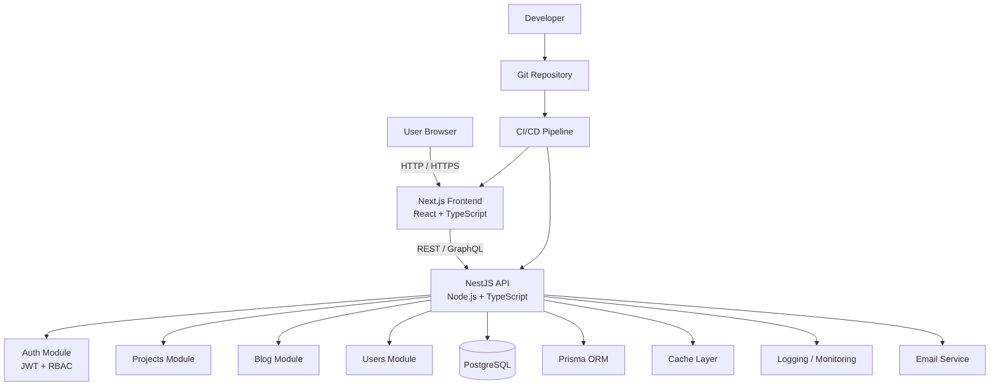
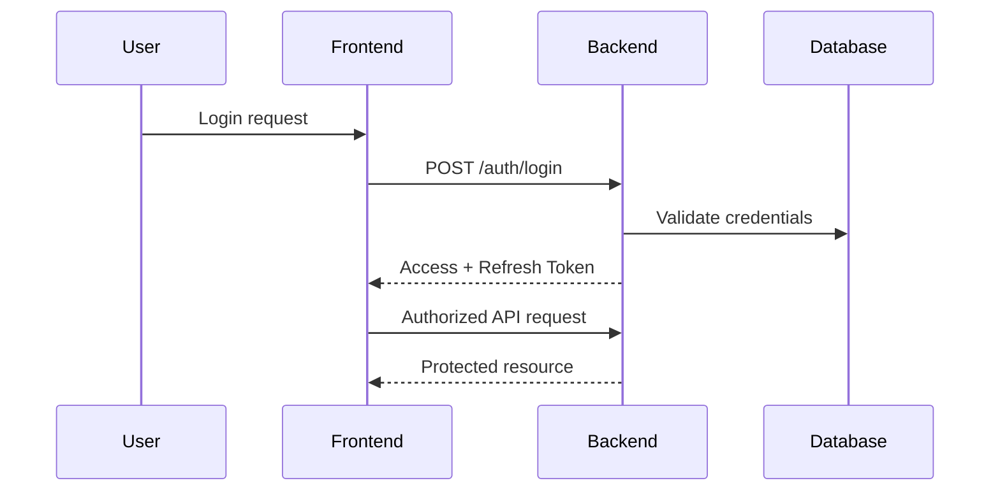

# 🏗️ DevAtlas — System Architecture Diagram

This document describes the high-level architecture of the DevAtlas platform, a fullstack portfolio system designed as a real-world, production-grade application.

---

## 🌐 High-Level Architecture Overview

---

## 🧩 Architecture Layers 

1️⃣ Client Layer
- Web browser
- Consumes server-rendered and statically generated pages
- Interacts with APIs via REST and GraphQL
- Optimized for SEO and performance

---

2️⃣ Frontend Layer — Next.js
- Framework: Next.js (App Router)
- Rendering Strategies:
  - Static Site Generation (SSG)
  - Server-Side Rendering (SSR)
  - Incremental Static Regeneration (ISR)
- State Management:
  - React Context API
  - Redux Toolkit
  - TanStack Query
  - Styling: TailwindCSS
  -  SEO: Metadata API, Open Graph, sitemap
  - Performance: Code splitting, image optimization, caching

---

3️⃣ Backend Layer — NestJS
- Framework: NestJS
- Architecture: Modular, Domain-Oriented
- API Types:
  - RESTful endpoints
  - GraphQL API
- Security:
  - JWT Authentication
  - Refresh Tokens
  - Role-Based Access Control (RBAC)
- Cross-Cutting Concerns:
  - Validation
  - Logging
  - Error handling
  - Guards and Interceptors

---

4️⃣ Domain Modules
- Each module follows a layered structure:
  - Application: Use cases, services
  - Domain: Entities, business rules
  - Infrastructure: Controllers, repositories, adapters
- Modules:
  - Auth
  - Users
  - Projects
  - Blog

---

5️⃣ Data Layer
- Database: PostgreSQL
- ORM: Prisma
- Migrations & Seeds
- Strong typing and schema validation

---

6️⃣ External Services
- Email provider0 (notifications, auth flows)
- Logging & monitoring (structured logs)
- Optional caching layer (Redis / in-memory)

---

7️⃣ CI/CD & Infrastructure
- Gitflow-based development
- GitHub Actions pipeline
- Automated linting, testing, and builds
- Dockerized frontend and backend
- Environment-based deployments (Preview / Staging / Production)

---

## 🔐 Security Flow (Simplified)

---

## ⚡ Data Flow Summary

---

- Frontend handles rendering and user interaction
- Backend centralizes business logic and security
- Database stores persistent data
- CI/CD ensures quality and consistency
- Architecture supports scalability and testability

---

## 🎯 Architectural Principles

- Separation of Concerns
- Single Responsibility
- Explicit boundaries
- Test-first mindset
- Production-ready patterns

> **DevAtlas architecture is intentionally designed to reflect real-world engineering practices, not demo-level code.**
